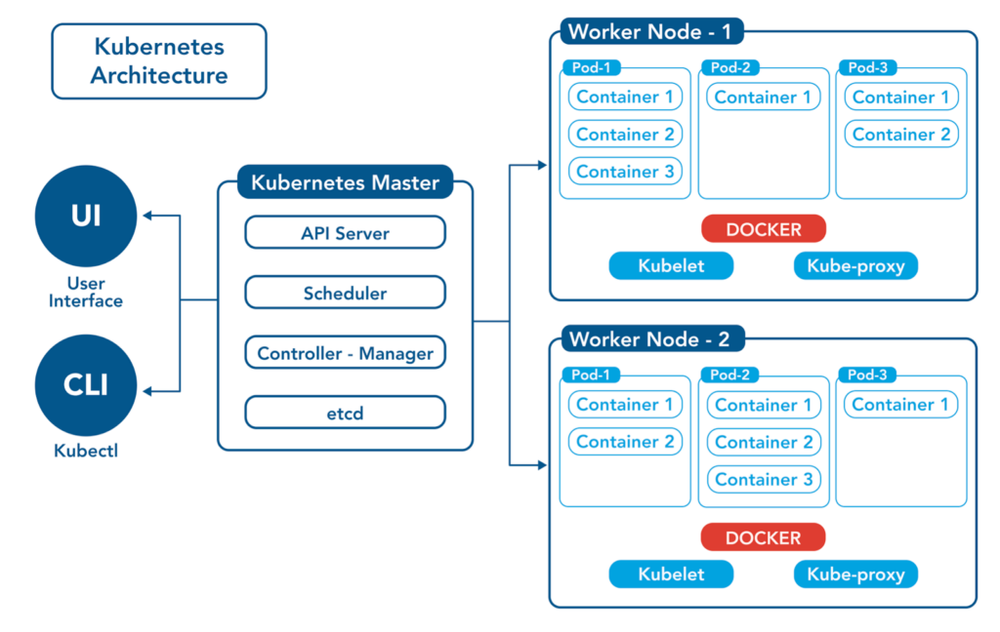

# Kubernetes Architecture

*Image Reference: https://www.opsramp.com/guides/why-kubernetes/kubernetes-architecture/*

**Kubernetes Ecosystem Consists of Two things:**

- Master Node
- Worker Nodes or Simply Node

In kubernetes, every operation is handled as a REST API.

## 1. Master Node:

- Also called controll plane nodes.
- Manages overall state and operation of kubernetes.
- Consists of **API Server, Controller Manager, Scheduler, etcd**

## 1.1 API Server: (kube-apiserver)

- Frontend for kubernetes controll plane.
- All actions, operations and commands passes through this layer.
- Other components co-ordinates with this layer for any actions.
- Validates and processes every actions and commands as a REST requests.

- [REST APIS endpoints](https://kubernetes.io/docs/concepts/overview/kubernetes-api/)

- [Python Client Side Interface](https://github.com/kubernetes-client/python)

## 1.2. Controller Manager: (kube-controller-manager)

It's a control loop that continuously monitors the state of the cluster and attempts to bring the actual state to match the desired state specified in the Kubernetes resources (YAML or JSON).

- Ensures the actual state matches the desired state defined by users.

- Continuously monitors the cluster and reconciles differences.

**Types Of Builtin Controllers:**

- Replication Controller
    - Ensures number of pod replicas runing all the times.

- Deployment Controller
    - Higher Abstraction than Replication Controller.
    - Generally Used by Stateless Application.
    - Handles rolling updates, scaling, and rollbacks.

- DaemonSet Controller
    - Ensures that one pod runs on every (or selected) node in the cluster.
    - Useful for logging or monitoring agents.
    - **Example:** Running Fluentd or Prometheus Node Exporter on all nodes.

- StatefulSet Controller
    - Manages stateful applications (e.g., databases) requiring stable identity and storage.
    - Ensures each pod gets a unique identity and persistent volume.
    - **Examle:** Deploying a Cassandra or MySQL cluster.

- Job Controllers
    - Manages batch or one-off tasks that are meant to run to completion.
    - **Example:** Running a data processing script once.

- CronJobController
    - Manages jobs triggered at scheduled times.
    - **Example:** Backing up a database every night.

- Service Controller
    - Ensures external load balancers or DNS records are created for a Service resource.

- Ingress Controller:
    - Manages HTTP and HTTPS routing to services in the cluster.
    - Common implementations include NGINX, Traefik, or HAProxy.

- Namespace Controller
    - Manages lifecycle events like deleting all resources in a namespace when the namespace is deleted.

- Node Controller
    - Monitors node health and manages actions like marking nodes as unschedulable.

**Stateless Application:** => Code, Frontend, Backend Codes.
**Stateful Applications:** => Databases (record which changes over time)

## 1.3. Scheduler

- Master component that is responsible for assigning unschedulded pods to nodes in cluster. 

- Ensures that workloads are efficiently and fairly distributed based on resource requirements, policies, and constraints.

**Key Features of the Kubernetes Scheduler**

- **Pod Assignment:** Automatically assigns a node to a pod that does not have one. Works with pods in the "Pending" state.

- **Resource Awareness:** Considers CPU, memory, storage, and other resource requests.

- **Policy-Driven:** Supports affinity/anti-affinity rules, taints tolerations, and custom constraints.

- **Extensible:** Allows custom schedulers for advanced use cases.

